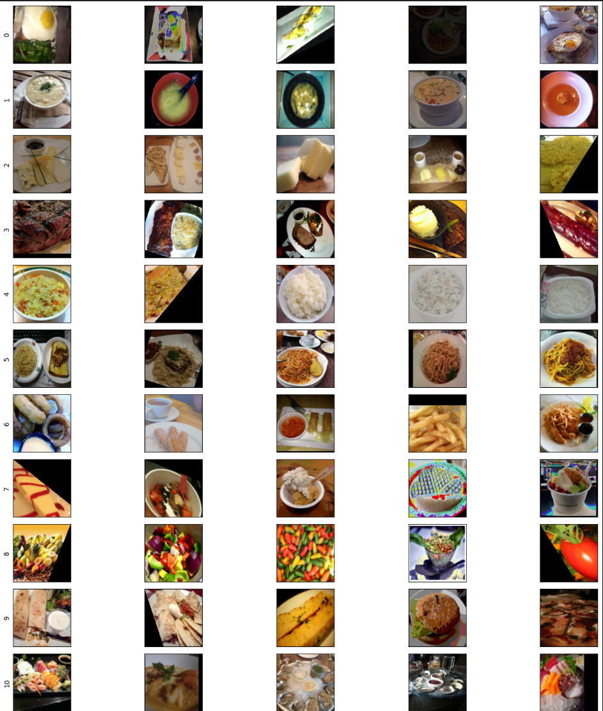
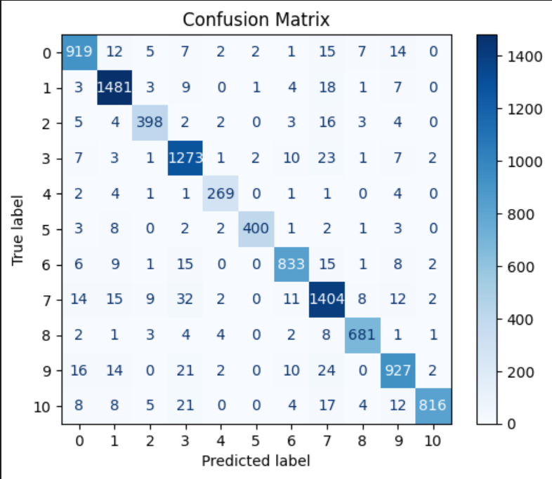
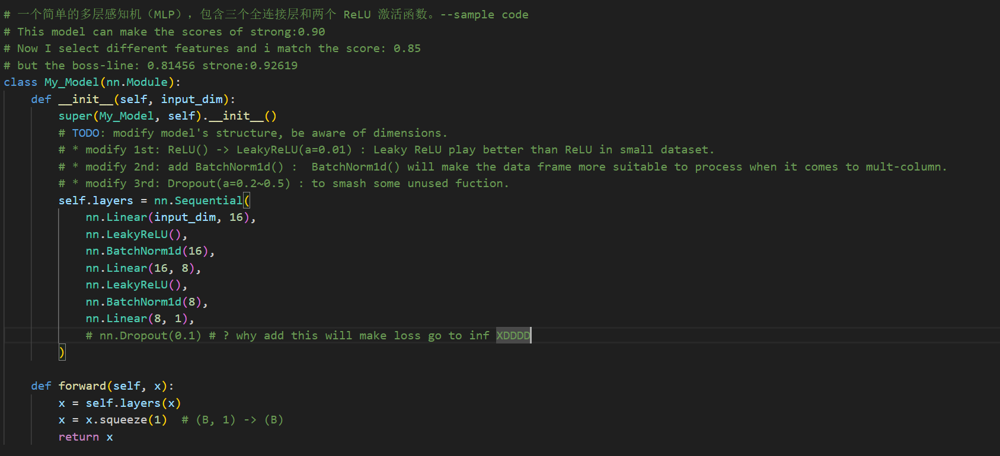
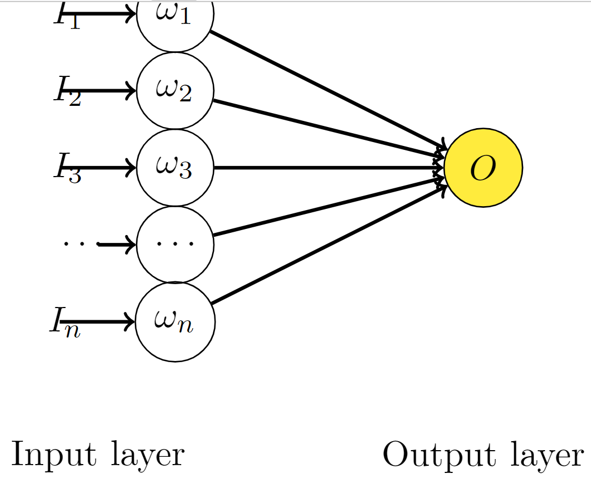

 # report of HW1

# 任务目标（图像分类）
使用 CNN 进行图像分类，属于分类任务。

# 性能指标（Metric）
在测试集上的分类精度： $$ Acc = \frac{pred==label}{len(data)} * 100% \nonumber $$

# 数据解析
- ./train (Training set): 图像命名的格式为 "x_y.png"，其中 x 是类别，含有 10,000 张被标记的图像
- ./valid (Valid set): 图像命名的格式为 "x_y.png"，其中 x 是类别，含有 3,643 张被标记的图像
- ./test (Testing set): 图像命名的格式为 "n.png"，n 是 id，含有 3,000 张未标记的图像

数据集为food11数据集，共有11个类别。

根据人工比对，我们不难看出这些编号分别对应什么种类的食物。
| 种类 | 标签            | 数量 |
| ---- | --------------- | ---- |
| 0    | Egg             | 984  |
| 1    | Soup            | 1527 |
| 2    | Dairy Product   | 437  |
| 3    | Meat            | 1330 |
| 4    | Rice            | 283  |
| 5    | Noddles-Pasta   | 422  |
| 6    | Fried food      | 890  |
| 7    | Dessert         | 1509 |
| 8    | Vegetable-Fruit | 707  |
| 9    | Bread           | 1016 |
| 10   | Seafood         | 895  |

我们随机选取了每个种类的一些图片进行展示，如下(已经经过train_tfm处理)：


省流不看版本:


# 实验结果
直接上图:

以及混淆矩阵:

# 相关理论
#### 1.Dropout层
相关链接:[The magic of NO dropout](https://www.kaggle.com/competitions/commonlitreadabilityprize/discussion/260729)
在做Lihongyi_HW1时，我尝试了dropout层，但是发现只要添加后就会让Loss跑飞，详细如下：

但是在这个分类任务中，我发现dropout层可以很好的防止过拟合，并且可以显著提高准确率，详细请看模型结构中的FC全连接层。
###### Dropout的数学原理
考虑简单的线性神经网络:

可以看出他的输出为:
$$
O = \sum_{i}^n w_i I_i 
$$
对于无Dropout的网络，如果 t 是目标值:
$$
E_{N}=\frac{1}{2}\left(t-\sum_{i=1}^{n} w_{i}^{\prime} I_{i}\right)^{2} 
$$
$\omega'$ 是为了找到之后要介绍的加入Dropout的网络的关系，其中 $\omega'=p\omega$ 。
$$
E_N = \frac{1}{2}\left(t-\sum_{i=1}^{n} p_i w_{i} I_{i}\right)^{2} 
$$
$$
\frac{\partial E_{N}}{\partial w_{i}}=-t p_{i} I_{i}+w_{i} p_{i}^{2} I_{i}^{2}+\sum_{j=1, j \neq i}^{n} w_{j} p_{i} p_{j} I_{i} I_{j}
$$
当我们添加Dropout之后可知：假设丢失率$\delta \sim \text{Bernoulli}(p) $服从伯努利分布，即它有 p 的概率值为 1 ， 1-p 的概率值为 0 。
那么
$$
E_{D}=\frac{1}{2}\left(t-\sum_{i=1}^{n} \delta_i w_{i} I_{i}\right)^{2} $$
$$
\frac{\partial E_{D}}{\partial w_{i}}=-t \delta_{i} I_{i}+w_{i} \delta_{i}^{2} I_{i}^{2}+\sum_{j=1, j \neq i}^{n} w_{j} \delta_{i} \delta_{j} I_{i} I_{j} $$
$$
\begin{aligned} E\left[\frac{\partial E_{D}}{\partial w_{i}}\right] &=-t p_{i} I_{i}+w_{i} p_{i}^{2} I_{i}^{2}+w_{i} \operatorname{Var}\left(\delta_{i}\right) I_{i}^{2}+\sum_{j=1, j \neq i}^{n} w_{j} p_{i} p_{j} I_{i} I_{j} \\ &=\frac{\partial E_{N}}{\partial w_{i}}+w_{i} \operatorname{Var}\left(\delta_{i}\right) I_{i}^{2} \\ &=\frac{\partial E_{N}}{\partial w_{i}}+w_{i} p_i \left(1 - p_{i}\right) I_{i}^{2} \end{aligned} 
$$
我们可以看出，在 $\omega'=p\omega$的前提下，带有Dropout的网络的梯度的期望等价于带有正则的普通网络。换句话说，Dropout起到了正则的作用，正则项为$ w_{i} p_i \left(1 - p_{i}\right) I_{i}^{2}$ 。
###### 那么为什么会这样呢？
> 没有添加Dropout的网络是需要对网络的每一个节点进行学习的，而添加了Dropout之后的网络层只需要对该层中没有被Mask掉的节点进行训练。


# 过程探索
感谢github项目的[**测试**](https://github.com/Hoper-J/HUNG-YI_LEE_Machine-Learning_Homework/tree/master/HW03):
<!-- 为我写一个markdown格式 -->
| Model                               | publicScore | privateScore |
| ----------------------------------- | ----------- | ------------ |
| Classifier & ResNet50 & DenseNet121 | 0.85333     | 0.84200      |
| Classifier                          | 0.84200     | 0.83133      |
| Classifier & DenseNet121            | 0.83866     | 0.83333      |
| ResNet50 & DenseNet121              | 0.83666     | 0.82466      |
| DenseNet121                         | 0.83666     | 0.83133      |
| Classifier & ResNet50               | 0.83400     | 0.82066      |
| ResNet50                            | 0.82600     | 0.81000      |


| dropout_rate | public_score | private_score |
| ------------ | ------------ | ------------- |
| 0            | 0.78466      | 0.79266       |
| 0.1          | 0.78800      | 0.79266       |
| 0.2          | 0.78400      | 0.78333       |
| 0.25         | 0.80866      | 0.79666       |
| 0.3          | 0.79866      | __0.81666__   |
| 0.4          | 0.79000      | 0.79466       |
| 0.45         | 0.78866      | 0.79800       |
| 0.5          | __0.81666__  | 0.80000       |
| 0.55         | 0.79533      | 0.79000       |
| 0.6          | 0.77733      | 0.78466       |

# 模型结构
```python
Classifier(
  (cnn): Sequential(
    (0): Conv2d(3, 64, kernel_size=(3, 3), stride=(1, 1), padding=(1, 1))
    (1): BatchNorm2d(64, eps=1e-05, momentum=0.1, affine=True, track_running_stats=True)
    (2): LeakyReLU(negative_slope=0.01)
    (3): MaxPool2d(kernel_size=2, stride=2, padding=0, dilation=1, ceil_mode=False)
    (4): Conv2d(64, 128, kernel_size=(3, 3), stride=(1, 1), padding=(1, 1))
    (5): BatchNorm2d(128, eps=1e-05, momentum=0.1, affine=True, track_running_stats=True)
    (6): LeakyReLU(negative_slope=0.01)
    (7): MaxPool2d(kernel_size=2, stride=2, padding=0, dilation=1, ceil_mode=False)
    (8): Conv2d(128, 256, kernel_size=(3, 3), stride=(1, 1), padding=(1, 1))
    (9): BatchNorm2d(256, eps=1e-05, momentum=0.1, affine=True, track_running_stats=True)
    (10): LeakyReLU(negative_slope=0.01)
    (11): MaxPool2d(kernel_size=2, stride=2, padding=0, dilation=1, ceil_mode=False)
    (12): Conv2d(256, 512, kernel_size=(3, 3), stride=(1, 1), padding=(1, 1))
    (13): BatchNorm2d(512, eps=1e-05, momentum=0.1, affine=True, track_running_stats=True)
    (14): LeakyReLU(negative_slope=0.01)
    (15): MaxPool2d(kernel_size=2, stride=2, padding=0, dilation=1, ceil_mode=False)
    (16): Conv2d(512, 512, kernel_size=(3, 3), stride=(1, 1), padding=(1, 1))
    (17): BatchNorm2d(512, eps=1e-05, momentum=0.1, affine=True, track_running_stats=True)
    (18): LeakyReLU(negative_slope=0.01)
    (19): MaxPool2d(kernel_size=2, stride=2, padding=0, dilation=1, ceil_mode=False)
  )
  (fc): Sequential(
    (0): Dropout(p=0.5, inplace=False)
    (1): Linear(in_features=8192, out_features=1024, bias=True)
    (2): LeakyReLU(negative_slope=0.01)
    (3): Dropout(p=0.5, inplace=False)
    (4): Linear(in_features=1024, out_features=512, bias=True)
    (5): LeakyReLU(negative_slope=0.01)
    (6): Dropout(p=0.5, inplace=False)
    (7): Linear(in_features=512, out_features=11, bias=True)
    (8): LogSoftmax(dim=None)
  )
)


```
# 附录A-我的CNN模型与其他pre-train模型的架构
#### Please be alert that the following models are not pre-trained models, but the architecture of those CNN model is similar to the pre-trained models.
```python
class Classifier(nn.Module):
    def __init__(self):
        super(Classifier, self).__init__()
        # torch.nn.Conv2d(in_channels, out_channels, kernel_size, stride, padding)
        # torch.nn.MaxPool2d(kernel_size, stride, padding)
        # input 維度 [3, 128, 128]
        self.cnn = nn.Sequential(
            #############################################################
#             BOTTOM 网络的底层部分，这些层主要用于提取低级特征，如边缘和纹理。
            nn.Conv2d(3, 64, 3, 1, 1),  # [64, 128, 128]
            nn.BatchNorm2d(64),
            nn.LeakyReLU(),
            nn.MaxPool2d(2, 2, 0),      # [64, 64, 64]

            nn.Conv2d(64, 128, 3, 1, 1), # [128, 64, 64]
            nn.BatchNorm2d(128),
            nn.LeakyReLU(),
            nn.MaxPool2d(2, 2, 0),      # [128, 32, 32]
            ##############################################################
#             MIDIUM 网络的中层部分，这些层用于提取中级特征，如形状和部分结构。
            nn.Conv2d(128, 256, 3, 1, 1), # [256, 32, 32]
            nn.BatchNorm2d(256),
            nn.LeakyReLU(),
            nn.MaxPool2d(2, 2, 0),      # [256, 16, 16]
            ##############################################################
#             TOP 网络的顶层部分，这些层用于提取高级特征，如整体结构和语义信息。
            nn.Conv2d(256, 512, 3, 1, 1), # [512, 16, 16]
            nn.BatchNorm2d(512),
            nn.LeakyReLU(),
            nn.MaxPool2d(2, 2, 0),       # [512, 8, 8]
            
            nn.Conv2d(512, 512, 3, 1, 1), # [512, 8, 8]
            nn.BatchNorm2d(512),
            nn.LeakyReLU(),
            nn.MaxPool2d(2, 2, 0),       # [512, 4, 4]
        )
        self.fc = nn.Sequential(
            nn.Dropout(p=0.5),
            nn.Linear(512*4*4, 1024),
            nn.LeakyReLU(),
            nn.Dropout(0.5),
            nn.Linear(1024, 512),
            nn.LeakyReLU(),
            nn.Dropout(0.5),
            nn.Linear(512, 11),
            nn.LogSoftmax()
        )
    def forward(self, x):
        out = self.cnn(x)
        out = out.view(out.size()[0], -1)
        return self.fc(out)

    
class ResNet34(nn.Module):
    def __init__(self):
        super(ResNet34, self).__init__()
        self.model = resnet34(weights=None)
        num_features = self.model.fc.in_features
        self.model.fc = nn.Linear(num_features, 11)
        self.model.num_classes = 11
        
    def forward(self, x):
        return self.model(x)
    
class ResNet50(nn.Module):
    def __init__(self):
        super(ResNet50, self).__init__()
        self.model = resnet50(weights=None)
        num_features = self.model.fc.in_features
        self.model.fc = nn.Linear(num_features, 11)
        self.model.num_classes = 11
        
    
    def forward(self, x):
        return self.model(x)

    
class VGG16(nn.Module):
    def __init__(self):
        super(VGG16, self).__init__()
        self.model = vgg16(weights=None)
        num_features = self.model.classifier[6].in_features
        self.model.classifier[6] = nn.Linear(num_features, 11)
        self.model.num_classes = 11

    def forward(self, x):
        return self.model(x)


class DenseNet121(nn.Module):
    def __init__(self):
        super(DenseNet121, self).__init__()
        self.model = densenet121(weights=None)
        num_features = self.model.classifier.in_features
        self.model.classifier = nn.Linear(num_features, 11)
        self.model.num_classes = 11

    def forward(self, x):
        x = self.model(x)
        return x
    

class AlexNet(nn.Module):
    def __init__(self):
        super(AlexNet, self).__init__()
        self.model = alexnet(weights=None)
        num_features = self.model.classifier[6].in_features
        self.model.classifier[6] = nn.Linear(num_features, 11)
        self.model.num_classes = 11

    def forward(self, x):
        x = self.model(x)
        return x
    
    
class SqueezeNet(nn.Module):
    def __init__(self):
        super(SqueezeNet, self).__init__()
        self.model = squeezenet1_0(weights=None)
        # (1): Conv2d(512, 1000, kernel_size=(1, 1), stride=(1, 1))
        num_features = self.model.classifier[1].in_channels
        self.model.classifier[1] = nn.Conv2d(num_features, 11, kernel_size=(1,1), stride=(1,1))
        self.model.num_classes = 11
        
    def forward(self, x):
        x = self.model(x)
        return x
``` 
